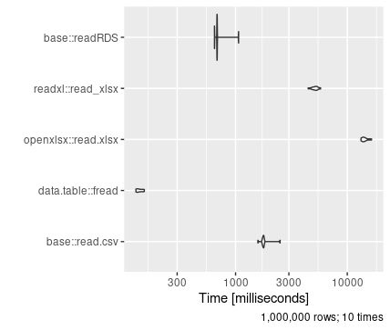
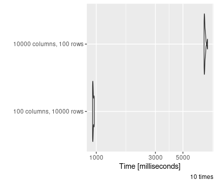
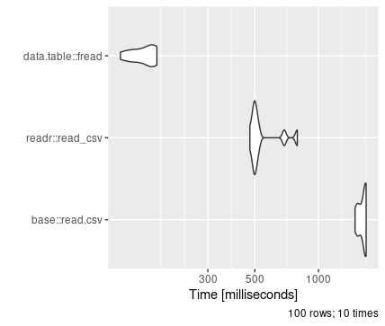
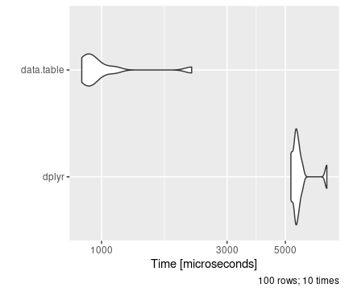

# Code efficiency and speed {#efficiency}

This chapter discusses the basics of how to optimise your R code so that it runs efficiently and quickly. Some of the major drawbacks of coding in R are the slow speed of the code, and its heavy use of RAM, but writing appropriate code can mitigate these drawbacks for all but the most complex processes.

## Checking code speed

If you are finding that code is running slowly, you can use *benchmarking* to identify bottlenecks which are causing your code to run slowly.

Wrapping any part of your code in `system.time()` is a good basic check of how long it takes to run. The drawback of this is that when code is already fast, the most significant impact will be from background processes on your computer, and results will vary.

For a more detailed check, you can use the *profvis* library. Wrapping your whole code in the `profvis()` function provides a graphical breakdown of how long individual lines take to run, allowing you to pick the points you want to optimise.

```{r, echo=FALSE, message=FALSE, echo=FALSE}
library(profvis) 

profvis({   
  library(dplyr)   
  library(ggplot2)      
  # Simulate data   
  n <- 5000000   
  dat <- data.frame(norm = rnorm(n),
                    unif = runif(n),
                    poisson = rpois(n, lambda = 5))      
  # Compute more variables   
  dat <- dat %>%     
    mutate(var1 = norm + unif,            
           var2 = poisson - unif + min(poisson - unif),            
           var3 = 3 * unif - 0.5 * norm)      
  # Plots   
  ggplot(dat, aes(x = var1, y = var3)) +
    geom_point() +     
    geom_smooth(method = lm)   
  
  ggplot(dat, aes(var1)) + 
    geom_histogram() +
    geom_vline(xintercept = 0, color = "red")      
  
  # Models   
  modLm <- lm(var1 ~ var2 + var3, data = dat)   
  summary(modLm)   
  modGlm <- glm(var1 ~ var2 + var3, data = dat,                 
                family = gaussian(link = "identity"))   
  summary(modGlm) })
```


## Data read efficiency

While R is capable of reading data in from a large variety of file types, some of these are more complex than others to read from and as a result, have higher processing overheads.

An example below shows the speed of reading the same data from CSV, xlsx and RDA formats. As you can see, reading in data from an xlsx file vs an efficient CSV read can take around 100 times longer. 

```{r, fig.alt="File reading speed demonstration with different formats", echo=FALSE, out.height = "400px", out.width="400px"}

```


As a result, you should aim to save data as flat files such as CSV or RDA files wherever possible. Data that you will reuse should always be converted to a flat-file format rather than reading in from xlsx tables.

In addition to this, the structure of your data also impacts how fast it is to read. As any data read needs to determine the data type for each column, reading in extra columns is always much slower than reading in extra rows; even if overall the size of the data is the same! 

```{r, fig.alt="File reading speed demonstration long vs wide format", echo=FALSE, out.height = "400px", out.width="400px"}

```


This is one of many reasons why tidy (long) data is preferable to wide data; you should always aim to store data in tidy data formats. You can read more about the principles of tidy data [here](https://r4ds.had.co.nz/tidy-data.html) 

## RAM usage

As previously mentioned, R is known as a RAM-intensive language as by default, all created objects are stored in RAM.

You can check what objects are present in your current environment by running `ls()`. Multiple large objects can slow down the running speed of your code, or lead you to run out of RAM completely (and your code will fail at this point)

There are several ways you can improve how your code makes use of RAM:

* **Limiting number of large objects created.** You should be aiming to only produce the large objects that you need to. For example, when adding an additional column to a large data frame, you can append this to the original object rather than creating an entirely new data frame. 

* **Remove objects when you're done with them.** If you do need to create multiple large objects, you don't need to leave them in your environment once they're no longer needed. You can remove individual objects from your environment using the `rm()` function. It is best practice to clean out your environment at the end of running a project for both efficiency and reproducibility, which can be done with `rm(list = ls())`.

* **Only working with the data you need to.** Often we end up using large datasets when actually we only require a small portion of them. If you can carry out processes such as summarising, filtering or selecting specific columns first, this minimises the size of the dataset you'll be carrying out more RAM-intensive processes on.

* **Storing hard copies of files.** If you need to create a large data object and reuse it at a later point, it is best practice to save the data in long term memory (as a CSV or other flat file) and read it in again, rather than keeping it in RAM.

* **Using functions where possible.** In addition to making code simple to read and modify, functions can also help improve code efficiency. Multiple large objects can be created and processed inside the function environment, however these are not stored in RAM long term as they are removed when the function ends. Writing functions also allows for mapping functions across code using the `purrr`package, which allows for highly efficient looping.

## Package selection

As previously discussed, there are a wide range of R packages available. While many are designed to be easy to use and understand, others are built with the primary function of speed and efficiency.

An example of this is use of the package `data.table`. In comparison to both base R and dplyr, data.table offers significant speed benefits while also minimising memory usage. This applies for both reading and more general data manipulation:

```{r, fig.alt="File reading speed demonstration different CSV reading packages", echo=FALSE, out.height = "400px", out.width="400px"}

```

```{r, fig.alt="File reading speed demonstration different CSV reading packages", echo=FALSE, out.height = "400px", out.width="400px"}

```


The real benefits of data.table become evident beyond 100,000 rows of data; below this, the improvements are minimal and generally don't outweigh the benefit of the simpler dplyr syntax.

